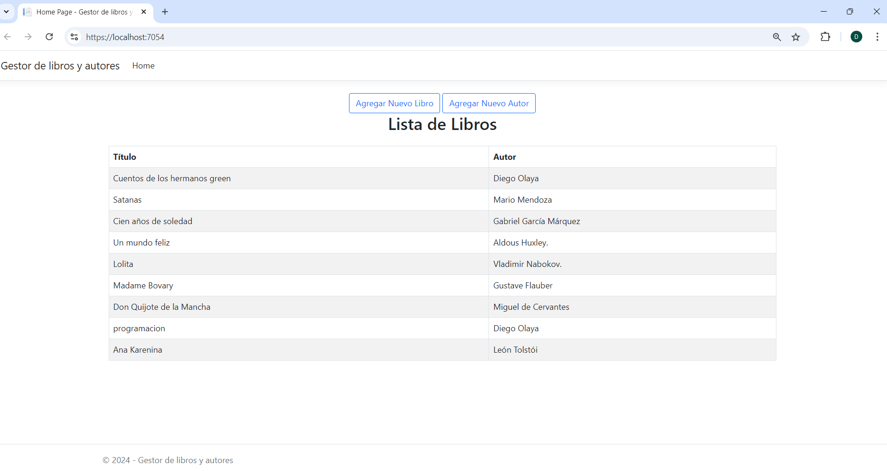
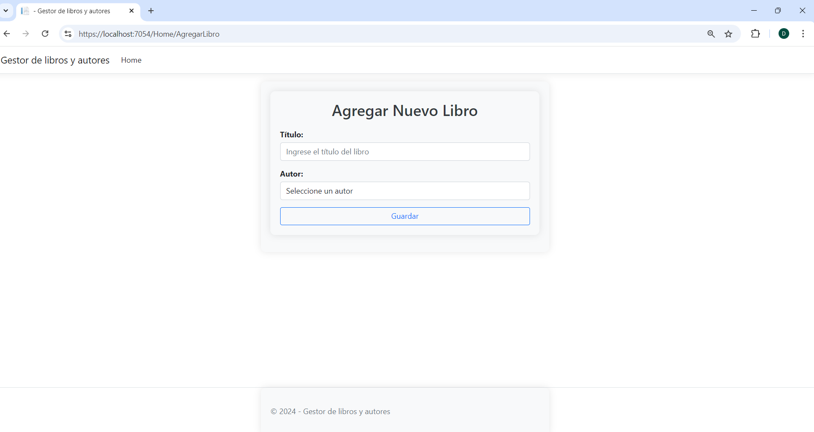
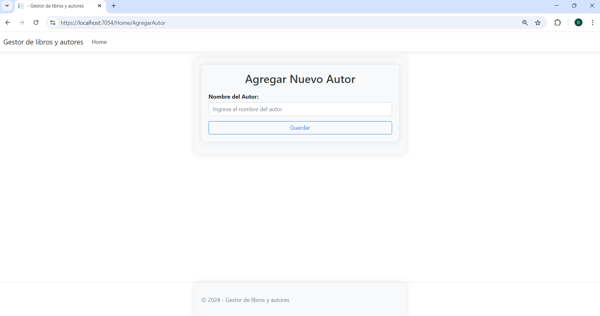

# Gestor de Libros Y Autores

Este proyecto es una aplicación web desarrollada en ASP.NET Core MVC, que permite la gestión de libros y autores. Los usuarios pueden agregar nuevos libros, asociarlos con autores existentes, y también crear nuevos autores. La base de datos utilizada es SQL Server, y se realiza mediante Entity Framework Core.

La aplicación tiene las siguientes funcionalidades:
- **Listar libros**: Muestra todos los libros registrados en la base de datos, junto con su respectivo autor.
- **Agregar libros**: Permite agregar nuevos libros a la base de datos, seleccionando un autor existente.
- **Agregar autores**: Permite agregar nuevos autores a la base de datos.
- **Relaciones**: Cada libro está asociado a un autor, gestionando la relación desde la interfaz de usuario.

## Pasos para Configurar y Ejecutar la Aplicación

1.**Crear una instancia y una base de datos **

Creamos una instancia con SQL SERVER la cual llamaremos SQLEXPRESS después crearemos por medio de SQL Management Studio una base de datos que llamaremos "Biblioteca"

2**Configurar la cadena de conexión**

Abre el archivo appsettings.json y configura la cadena de conexión para que apunte a tu servidor de SQL Server

"ConnectionStrings": {
    "DefaultConnection": "Server=ALEJO\\SQLEXPRESS;Database=biblioteca;Trusted_Connection=True;Encrypt=False;"
  }

3.**Aplicar migraciones**

Abre la consola del Administrador de Paquetes de NuGet y ejecuta los siguientes comandos para crear las tablas:

Update-Database

4**Ejecutar la aplicación 

Podemos ejecutar directamente desde visual Studio o podemos utilizar el comando "dotnet run" para ejecutar la aplicación creando un host teniendo en cuenta que debemos estar dentro de la carpeta PruebaTecnica\PruebaTecnica en este caso podemos acceder a la aplicación ingresando al navegador y usar la siguiente dirección http://localhost:5185

##Funcionalidades 

## Autor

- Diego Alejandro Olaya Molano
